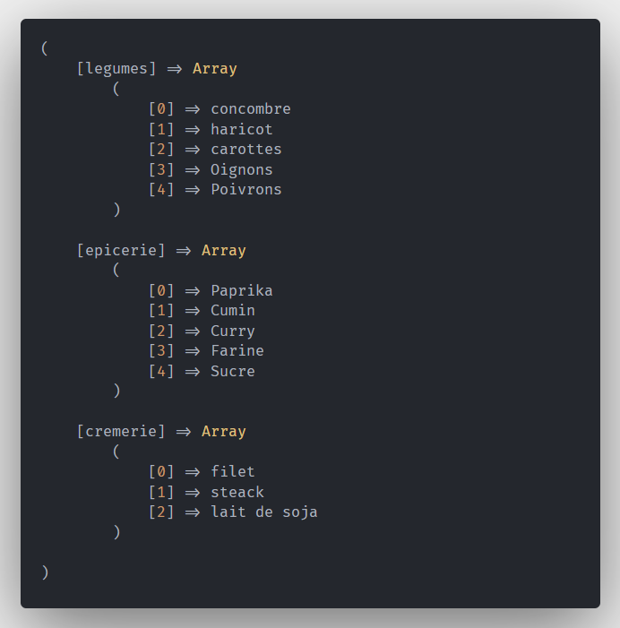

# Bienvenue dans Hell_Kitchen 👿

  ## Créer ton stock 
  - Pour commencer cuisiner dans les enfers, il va te falloir des ingredients, pour cela tu va devoir créer un tableau nommé '**gardeManger**'
  - Ce tableau va contenir 3 tableaux :
    - '**legumes**' 
    - '**epicerie**' 
    - '**cremerie**'

  ## Remplir le frigo !
  - Maintenant que tu as créé ton stock, il va falloir le remplir, par chance les camions de livraison viennent d'arriver !
  - Sert toi des boucles pour remplir notre garde manger avec les camions, résultat voulu : 
  

  ## Créer tes premieres recettes
  - Maintenant que nous avons notre stock plein nous allons créer nos premières recettes grâce aux boucles et au conditions bien sûr les ingrédients doivent provenir de notre **$gardeManger**!
  - Pour la première recette il nous faudra : **Salades, Tomates , Oignon , Curry , Oeufs** 
  - Pour la deuxième : **Navets, Poivrons , Beurre , Sel , Poivre**